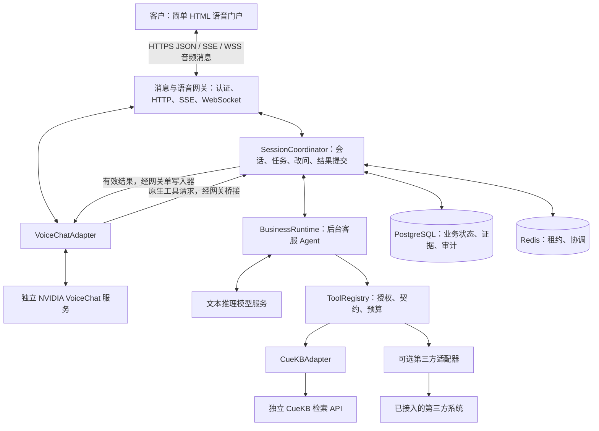

# 语音客服 Agent：最终设计与架构

定稿：2026-09-16。本文是唯一有效总设计，替代早期工作台方案和过程性提案。
**本次交付为设计与文档整理；目标功能尚未全部实现，当前差距见 [任务板](TASK_BOARD.md)。**

## 1. 产品定位与范围

本项目提供面向客户的语音客服 Agent。客户在简单 HTML 门户点击开始并说话，系统通过独立 VoiceChat 进行语音交互，通过 CueKB 获取授权知识，给出有依据的客服回答。

两类业务能力：

1. **知识问答**：调用独立 CueKB 的检索 API，处理证据、适用条件、引用和澄清。
2. **第三方扩展**：按部署实际接入和授权开放天气、股票或其他业务查询。只接 CueKB 时不提供第三方实时查询，未启用工具不影响启动或健康状态。

门户以语音为主，文字输入是可选降级入口。客户页面不包含工具管理、服务运维、知识上传等工作台功能；已有管理能力保留为受权限保护的独立运维入口。首期只读查询，不包含交易、订单修改、自动退款或人工坐席转接系统。

本期产品范围为英文知识库客服，只启用 `search_knowledge`；天气和其他第三方能力留待新需求。中文支持须等目标语音模型具备相应能力后，再明确本项目的语言契约和验收范围。本项目不训练模型、不管理语音 GPU 栈。当前代码中的中文门户文案、提示词及默认语言仍是后续英文适配任务，不能据此声明英文语音链路已验收。默认按单组织部署，客户可见知识范围由服务端决定；不宣称已有跨组织完整多租户能力。

## 2. 总体架构

三套业务系统独立运行：本项目、VoiceChat、CueKB。文本推理模型是本项目现有 BusinessRuntime 的额外推理依赖；“对接两个系统”不意味着只有两个后端连接或不需要文本模型。

### 2.1 模块职责

| 模块 | 负责 | 不承担 |
| --- | --- | --- |
| HTML 门户 | 开始/结束、采集、播放、字幕、答案/引用、状态提示 | 工具选择、权限判断、直接访问 VoiceChat/CueKB |
| 消息与语音网关 | 版本化消息、票据、音频队列、背压、供应商事件转换 | 知识检索推理和供应商业务逻辑 |
| SessionCoordinator | 任务版本、幂等、取消、租约、提交与交付控制 | 生成业务事实 |
| BusinessRuntime | 理解任务、澄清、选工具、组织证据答案 | 自行授予权限、直接操作播放器 |
| ToolRegistry / Adapter | 参数校验、服务端凭据、超时重试、结果映射 | 让模型任意构造 endpoint 或扩大 KB 范围 |
| VoiceChat | 流式语音理解、接话、语音生成、原生工具调用 | 作为企业知识事实来源 |
| CueKB | 授权范围内的检索、来源与版本 | 语音交互、替本项目完成回答充分性判断 |

复用 `apps/api/app/{api,voice,sessions,agent_runtime,tools,storage}`；供应商结构在 adapter 内消化，不泄漏到业务核心或客户门户。CueKB 的数据库/索引、迁移和发布由 CueKB 自己管理，本项目不直连其数据库。

### 2.2 技术与部署选择

- 后端沿用 Python 3.12 / FastAPI / Agents SDK；存储 PostgreSQL，跨副本协调 Redis。
- 门户交付为静态 HTML/CSS/浏览器脚本，复用 TypeScript AudioWorklet 音频代码；可用现有构建链产出，不强制为“简单 HTML”更换前端框架。
- 当前 React/Ant Design 页面已精简为客户入口，复用既有音频底层；工具管理只保留受权限保护的独立后端运维 API。
- 云端用 Docker Compose 运行本项目 Web/API/迁移/数据库/Redis；VoiceChat、CueKB 独立部署和维护。详情见 [部署](deployment.md)。

## 3. 门户与标准消息接口

客户端只调用本项目 API。采用标准 HTTPS JSON、SSE 和 WebSocket；业务事件由本项目版本化定义，不声称与 NVIDIA、OpenAI 或某个行业消息标准直接兼容。

| 通道 | 用途 |
| --- | --- |
| HTTPS `/api/v1` | 认证、能力查询、创建会话、申请语音票据、结束/打断、可选文字输入 |
| SSE 会话事件 | 查询状态、经校验答案和可恢复的业务事件 |
| WSS 语音消息 | 连续上行/下行音频、用户转写、实际口述字幕、实时控制 |

保留当前 `/api/v1` 路径及 `portal.*` 事件族。客户端不接收模型工具调用权限，不知道 CueKB/VoiceChat 的私网地址或密钥；相同契约可供以后其他客户端使用。详见 [门户契约](portal-protocol.md)。

## 4. 端到端调用流程

### 4.1 一次语音知识问答

1. 门户经客服系统身份认证，服务端解析客户身份与可用知识范围；创建 conversation。
2. 申请一次性语音票据并连接 WSS；网关连接独立 VoiceChat，确认握手及音频格式后通知门户 ready。
3. 门户持续上传包括静音在内的音频，网关并行收发；VoiceChat 生成用户转写、语音或工具请求。
4. VoiceChat 调用统一工具 `consult_service_agent(user_request)`。网关按连接、epoch、call_id 去重，交给 SessionCoordinator。
5. Coordinator 创建业务任务；BusinessRuntime 根据已确认上下文调用授权知识工具。CueKBAdapter 从服务端注入 KB 范围，调用 `POST /v1/search`。
6. Runtime 根据证据和适用条件输出 AnswerBundle：状态、展示答案、短口述、引用及必要卡片；依据不足时澄清或明确无依据。
7. Coordinator 检查任务是否仍有效并提交业务结果；网关单写入器再次检查连接、call_id、epoch/turn/租约，向 VoiceChat 回传结果。
8. VoiceChat 生成语音，门户播放；分别保留业务答案、实际口述字幕和估计播放进度。正确的文字答案不能代替实际口述正确性验收。

最终用户转写仅用于字幕和记录，不能再触发与原生工具相同的一次查询。无直接关联字段时不靠文字相似度猜测 call_id 与输入 item 的关系。

### 4.2 工具与子 agent 的取舍

CueKB 可以封装为 Tool。最终主线保留 **VoiceChat 统一业务工具 → 后台 BusinessRuntime → CueKB Tool**，便于统一权限、证据验证、第三方扩展及文字降级。

BusinessRuntime 相对前台语音已是被委派的后台 Agent；简单检索不再增加一次仅负责转发的 LLM。复杂跨文档任务确有收益时，可在相同 runtime 边界内引入 KnowledgeAgent，限制为一层、有独立上下文和共享预算的子任务。

子 agent 只返回候选证据/答案，由 Coordinator 统一提交；不能直接写主会话或播放音频。现有 `submit()` 会替换当前任务，不能用它启动子任务以免取消父任务。委派不等于工具等待期间的前台交谈能力。

### 4.3 第三方与文字入口

第三方查询沿用相同 Runtime/ToolRegistry，适配器负责地点、证券代码、时间、单位等厂商语义。未接入的能力明确告知不可用，不用知识库旧资料或模型常识冒充实时结果。

可选文字输入复用同一业务链路。当前实现提交文字会终止语音；首期保留并在门户提示，不在未定义话轮竞争规则时开启并行文字/语音提交。

## 5. 全双工、改问与工具生命周期

### 5.1 三个独立状态

- **语音连接**：connecting / ready / recovering / closed。
- **业务任务**：queued / running / completed / failed / canceled / expired / superseded。
- **结果交付**：pending_validation / accepted / discarded，接受后另记文字发布、语音提交、估计播放及中断/送达未知。

以上为目标内部状态，不是新增 NVIDIA 事件。应用任务完成不代表客户已听到。目标引入 `task_id`、`parent_task_id`、`request_revision`；现有 conversation/turn/epoch 保留。业务 revision 与音频 epoch 分开。

| 用户行为 | 任务处理 | 语音处理 |
| --- | --- | --- |
| 附和“嗯” | 默认继续，不能只因有声音就取消 | 按真实语音能力让话 |
| “先别说” | 保留仍有效查询 | 清播放器，抑制当前回复后续音频 |
| “不用查了” | 立即使任务失效，尽力取消外部等待 | 不交付晚到旧答案 |
| “不是 A，是 B” | 立即增加 revision，A 标 superseded，建立 B 任务 | 只允许新条件结果交付 |
| 断网、鉴权到期、租约失效 | 撤销提交权，释放资源 | 停止旧输出，受控恢复 |

D05 已实现独立 request_revision、停止播报和取消查询接口；兼容 `interrupt` 仍是清音、任务取消、epoch 失效及关闭连接的组合操作。门户不再把硬中断标成仅停止播报。

### 5.2 结果接受与原生调用结清

每次工具执行绑定任务版本、授权上下文、deadline、工具版本和原生调用标识。结果到达先核对业务有效性，再在历史提交及语音写回边界复核，避免晚到结果与改问竞争。

外部请求不能确认终止时，允许其在原预算内结束，旧结果不进入当前答案；逻辑失效无需等待 HTTP 完成。内部取消不能被记为上游计算已停止。

**丢弃业务内容仍须处理原生 pending call。** 只在部署协议验证通过后，才用匹配 call_id 的失效说明结束旧调用；该说明不是 NVIDIA 取消指令。若不能安全结清且抑制旧播报，关闭旧连接并重建，不能永远等待，也不能把旧 call_id 写到新连接。立即回传“已受理”不构成以后任意推送结果的合法通道。

当前原生连接保持单 pending call。新后台任务可否与旧任务并行执行，和语音服务能否同时接收新调用是两个问题；前者受应用预算限制，后者必须有协议证据。

### 5.3 能力门槛

默认保守方案：持续音频传输、原生工具往返、等待提示语、显式硬打断与重连。目标增强：查询等待期间理解用户改问、针对新问题回答、旧结果抑制及新结果交付。

模型卡的 on-hold message 不证明自由多轮交谈；官方限制页仍记录工具期间打断限制。公开不同推理实现有部分异步/插话路径，不能等同于当前独立服务能力。固定目标镜像/API 版本，按调用生成、HTTP 等待、结果注入、播报四阶段验收。[模型卡](https://huggingface.co/nvidia/NVIDIA-NemotronLabs-VoiceChat-11B/blob/main/README.md)、[限制说明](https://github.com/NVIDIA-NeMo/Speech/blob/nemotron-labs-voicechat/README.md#known-limitations)

若增强门槛未通过，只能声明基础语音客服可用，不能把增加子 agent 当作完整业务全双工已实现。当前默认 105 秒连接上限在 quiet 且无 pending call 时受控轮换并保留确认过的业务摘要；浏览器清除旧音频后取得新票据，不承诺恢复模型隐藏状态或重播旧音频。

## 6. 借鉴 harness 的应用控制层

这里 harness 指模型外的运行控制程序，借鉴会话、任务、工具和事件分层思路，落在现有模块中，不引入 Codex 服务作为运行依赖。

- 会话持有身份、确认条件和有界历史；任务持有目标、revision、父子关系、状态、预算与取消原因。
- 子任务使用独立 evidence/cards/slots 容器，不能共享可变 RunContext 后互相回滚；合并时重新校验引用。
- 权限只能从父任务缩小；父子任务共享剩余时限/调用预算。限制循环、递归和并发，不为每个子任务重新发放全额预算。
- 工具结果、主会话提交、媒体输出分离；Coordinator 是唯一业务提交者。持久化结果以唯一键和条件状态更新去重。
- 重启只恢复允许恢复的业务状态；未确认送达标为 unknown，不盲重发语音或宣称网络 exactly-once。
- PostgreSQL 保存业务历史/任务/证据与审计；Redis 管理租约。新字段通过 Alembic 迁移，历史 JSON 保留版本兼容。

不增加新的消息队列或多 agent 服务集群，除非容量/可靠性实测证明必要。

## 7. 权限、事实与故障边界

- 客户身份来自客服系统签名认证；客户仅能访问自己授权会话与知识，不能授予 operator/admin 来绕过当前身份限制。访客模式若需要，另定义受限服务端身份，不默认匿名开放。
- 有效 KB 范围 = 客户授权 ∩ 部署允许 ∩ CueKB 服务主体权限。CueKB API Key 身份不能通过自定义 user/tenant 请求头变成客户级委托身份。
- 资料属于不可信内容，仅作为证据；不执行资料中的指令/URL，不允许模型选择密钥、主机或扩大权限。
- 引用存在性不代表结论充分。保留版本、定位、降级原因与适用条件；缺失元数据不伪造，空命中/冲突/故障分开处理。
- VoiceChat 不可用时可提供明确文字降级；CueKB 不可用不能编造知识事实；可选工具故障仅影响相关能力。real 不回退 mock。
- 默认不存原始录音。业务日志脱敏并有保留期；历史证据和原件读取也要遵守撤权策略。

## 8. 可观测性与验收

关联 conversation、turn、task/revision、epoch、call_id、response_id、CueKB trace_id，但不暴露内部标识给普通客户。记录工具耗时、超时率、首段有效回答音频延迟、停止播放延迟、过期结果拒绝次数、引用与口述正确性。

等待提示语与有效答案的首音频延迟分开统计；模型演示指标不能当作本系统端到端 SLA。保留当前工具/任务预算作为起点，真实服务测试后确定阈值。

真实验收至少覆盖知识闭环、最小客户权限、5 秒工具等待中的新问题/改问、晚到结果、pending call 结清、断线与长会话、数字口述和并发隔离。检查清单与已执行结果只维护于 [验收记录](acceptance-report.md)。

## 9. 现状与实施顺序

已有会话、音频、SDK、工具注册和存储骨架。D01 已冻结门户事件契约和语音能力声明/探测边界，D02 已实现客户角色与知识历史撤权保护，D03–D05 已实现 CueKB 原生适配、简单客户门户、独立任务 revision 及停止播报/取消查询语义。主要缺口是 D06 按启用工具校验配置和 D07 真实身份/知识/语音/部署验收。

按 [任务板](TASK_BOARD.md) 的 D01–D07 执行；D01–D05 的本地代码阶段已完成，下一步实现 D06 按启用工具配置，最后在 D07 真实环境验证并部署。
