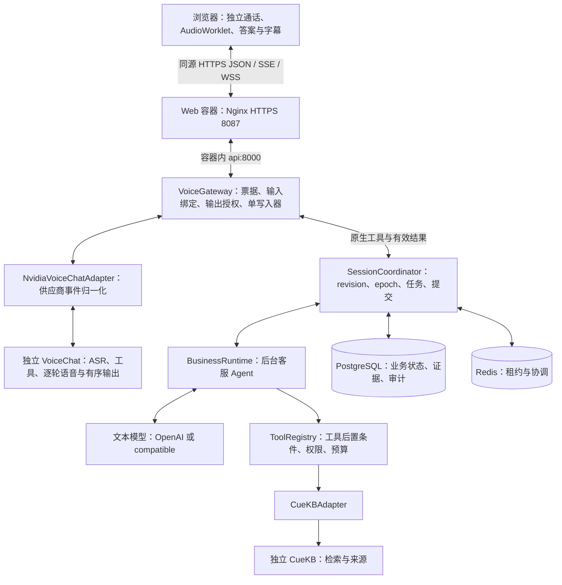

# 语音客服 Agent：架构与演进设计

更新：2026-09-28。本文定义当前产品、模块职责、语音与业务状态及故障边界。实现状态见 [任务板](TASK_BOARD.md)，验证证据见 [验收记录](acceptance-report.md)。当前设计包含 D19 的 WebSocket 输出/播放修复、D20 的原生能力边界和查询交付优化；真实识别、GPU 推理与听音仍待部署复测。§10 保留尚未实施的建议，不与现有能力混写。

## 1. 产品定位与范围

本期提供生产级英文知识库语音客服，仅启用 `search_knowledge`。客户在门户开始独立通话，用英文提问，系统从授权 CueKB 获取证据，给出文字答案、来源及短口述。VoiceChat 负责语音感知与生成，BusinessRuntime 负责客服任务和证据回答，两者不能互相替代。

每个完整客户发言，包括问候、听不清和闲聊，都先经 `consult_service_agent` 进入后台业务入口。缺少产品型号或专有名词时按最终转写澄清，不让语音模型改写成猜测的事实。知识请求必须通过 `search_knowledge` 的服务端后置条件；空命中、证据不足、澄清和系统故障是不同结果。VoiceChat 自有常识不能成为客服答案。

门户以语音为主，文字是可选降级入口；不提供工具管理、知识上传或运维工作台。首期只读，不包含交易、订单修改、自动退款、天气/股票或正式人工坐席转接。中文、正式客户登录、跨组织完整多租户及子 Agent 调度均不在本期。默认单组织部署，知识范围由服务端确定。

本项目不训练模型、不管理 GPU 调度。独立 `speech` 源码中的 WebSocket 协议修复随独立 VoiceChat 镜像交付；它不成为本项目的 Python 依赖或新服务。修改前后供应商代码版本必须进入发布基线。

## 2. 总体架构

```mermaid
flowchart TB
    U[浏览器：独立通话、AudioWorklet、答案与字幕]
    W[Web 容器：Nginx HTTPS 8087]
    G[VoiceGateway：票据、输入绑定、输出授权、单写入器]
    C[SessionCoordinator：revision、epoch、任务、提交]
    V[NvidiaVoiceChatAdapter：供应商事件归一化]
    N[独立 VoiceChat：ASR、工具、逐轮语音与有序输出]
    B[BusinessRuntime：后台客服 Agent]
    L[文本模型：OpenAI 或 compatible]
    T[ToolRegistry：工具后置条件、权限、预算]
    K[CueKBAdapter]
    Q[独立 CueKB：检索与来源]
    S[(PostgreSQL：业务状态、证据、审计)]
    R[(Redis：租约与协调)]
    U <-->|同源 HTTPS JSON / SSE / WSS| W
    W <-->|容器内 api:8000| G
    G <--> V <--> N
    G <-->|原生工具与有效结果| C
    C <--> B <--> L
    B --> T --> K --> Q
    C <--> S
    C <--> R
```

本项目、VoiceChat、CueKB 独立部署。文本模型是 BusinessRuntime 的推理依赖。浏览器只访问本项目同源入口，不获取供应商地址、密钥或原生工具执行权。天气等既有扩展适配器保留代码但本期不注册开放。

### 2.1 模块职责

| 模块 | 负责 | 不承担 |
| --- | --- | --- |
| 门户 / VoiceClient / AudioWorklet | 通话、收音、重采样、PCM 播放、字幕、状态和引用 | 知识权限、业务推理、供应商工具选择 |
| VoiceGateway / Adapter | 票据与会话 fence、输入 item 绑定、工具往返、输出授权和背压 | 生成企业事实、把整场连接永久授权为一个回答 |
| SessionCoordinator | 任务幂等、revision/epoch、取消、租约与业务提交 | 操作供应商隐藏状态 |
| BusinessRuntime | 理解最终 ASR/文字请求、澄清、知识工具和有据回答 | 自行授予权限、直接播放音频 |
| ToolRegistry / CueKBAdapter | 参数/结果契约、服务端凭据、范围、限时和证据映射 | 接受模型指定的 endpoint 或扩大 KB 范围 |
| 独立 VoiceChat | 流式 ASR、原生工具、ACK/回答语音、每轮 response 和有序发送 | 用常识绕过业务工具、把音频包数量当作听音成功 |
| CueKB | 授权检索、知识来源、版本与上下文 | 语音交互、替应用判断全部回答断言是否充分 |

沿用 `apps/api/app/{api,voice,sessions,agent_runtime,tools,storage}`。供应商结构只在 `voice/` 内归一化；Agents SDK 限于 `agent_runtime/`。本项目不直连 CueKB 数据库或索引。

### 2.2 技术与部署选择

后端为 Python 3.12/FastAPI/Agents SDK，状态存储 PostgreSQL，协调 Redis；依赖使用 pip 与固定版本 requirements。门户为 React/TypeScript，AudioWorklet 实现持续重采样和有界播放队列，不另建逐帧 AudioBufferSource 播放器。

Web 镜像内置 Nginx，标准部署直接提供公网 HTTPS `8087`，仅把同源 `/api/` 转发到容器内 API `8000`；API/数据库/Redis 不映射公网端口。现场入口若为 `9002`，需按实际域名、TLS、端口和反向代理核对 `PUBLIC_ORIGIN`，不能从端口推断它直连 VoiceChat。服务端到独立服务的受控内网 HTTP/WS 与浏览器 HTTPS/WSS 是不同连接。详见 [部署](deployment.md)。

## 3. 门户与标准消息接口

客户端契约是本项目的 `/api/v1` 和 `portal.*`，使用 HTTP JSON、SSE 和 WebSocket，不直接暴露 NVIDIA/OpenAI 事件。

| 通道 | 用途 |
| --- | --- |
| HTTPS JSON | 创建独立 conversation/call capability、申请票据、文字输入、停止/取消/结束 |
| SSE | 持久业务进度、经验证答案和历史恢复 |
| WSS | 连续音频、实时用户转写、实际口述文字、播放进度与错误 |

Start call 创建当前标签页独有的 conversation、owner 和短期 token；token 只保存在标签页内存。ready 表示语音握手和格式已确认，不表示已有问候或业务答案；连接初始自行生成的欢迎语被抑制。用户实时字幕在完成态后保留到持久 voice Turn 接管；实际口述字幕与业务答案分别展示。详情见 [门户契约](portal-protocol.md)。

## 4. 端到端调用流程

### 4.1 一次语音知识问答

1. 开始通话创建独立 capability，申请一次性、绑定 owner/conversation/epoch/Origin 的 WS ticket；VoiceGateway 连接 VoiceChat，完成 `session.created → session.update → session.updated` 后发 portal ready。
2. AudioWorklet 按 AudioContext 实际采样率重采样为 24 kHz、单声道 PCM16，每 80 ms 发送 3840 bytes，包括静音。48 kHz 采集与 VoiceChat 内部 16 kHz 推理都不改变这个线上协议。
3. VoiceChat 先发用户 input item 的开始/最终 ASR，再发原生工具事件；同一推理批次内，ASR/工具必须排在 ACK 音频之前。空闲 codec 音频不能创建持续整场的 response。
4. 网关将工具绑定到尚未消费的 input item，按 call_id 去重并验证参数；最终 ASR 是业务请求的权威文本。工具先于 ASR 完成时有界等待；无有效输入的工具只结清，不创建 Turn。最终 ASR 不额外启动第二次查询。
5. Coordinator 建立受 revision/epoch/租约保护的 Turn；Runtime 在整轮预算内调用文本模型、ToolRegistry 与 CueKB `/v1/search`。KB 范围来自服务端，知识检索与答案状态由服务端校验。
6. 业务答案通过有效性检查后提交，提交完成通知本机 SSE，门户直接更新已有 Turn；跨进程仍按持久游标补查，未知 Turn 才读取历史。VoiceGateway 单写入器在写回前再次核对 call、turn、revision、epoch 和租约，用原生 call_id 回传工具结果。
7. 工具 ACK 和最终回答分别结束自己的音频 response；固定 ACK 不得提前消耗后续答案的授权。若供应商在原 response 内返回最终答案，则在完成时撤销未使用的后续许可。新输入活动不撤销仍有效的已授权回答，但未桥接的直接回答必须拒绝。
8. VoiceChat 将音频、字幕和完成事件按生产顺序发送，排队事件携带原 response ID；尾部重采样和 PCM 残帧先发送，再发 audio.done。浏览器在实际队列排空后才清除当前播放身份，播放 ACK 只是估计。

### 4.2 工具与子 agent 的取舍

保留 **VoiceChat 统一业务工具 → BusinessRuntime → CueKB Tool**。后台 Runtime 已承担被委派的客服任务；简单知识检索不另加一个只负责转发的 LLM。`parent_task_id` 记录前一轮任务，不代表子 Agent。

未来只有复杂跨文档样本证明收益时才评估一层 KnowledgeAgent。子任务只返回候选证据，由 Coordinator 统一提交；不直接写会话或播放音频。现有 `submit()` 会替换当前任务，不能把它当作子任务调度器。增加 Agent 不能解决供应商工具等待期间的交互限制。

### 4.3 第三方与文字入口

文字输入复用同一 Runtime/ToolRegistry 和知识范围，提交文字会终止当前语音，门户须提示该行为。未定义话轮竞争规则前不并行提交文字与语音任务。

未来第三方查询仍通过既有工具边界，单独约定身份、时效、字段、预算和验收；本期不开放天气/股票，也不以旧知识或模型常识冒充实时结果。

## 5. 全双工、改问与工具生命周期

### 5.1 三个独立状态

| 状态层 | 含义与边界 |
| --- | --- |
| 连接和播放 | 连接 ready 不等于有答案；清空当前播放不等于结束会话；audio.done 不等于扬声器队列已排空 |
| 业务任务 | revision 控制当前请求；Turn 有运行、回答状态及 canceled/expired/superseded；epoch 隔离音频连接 |
| 结果交付 | pending_validation/accepted/discarded 描述业务接受；供应商写回、实际口述、播放估计分开记录 |

`accepted` 不证明客户听到。当前已有字幕和 playback_ack 持久化，但完整交付台账仍属 §10.1。`task_id` 对应 Turn，`parent_task_id` 不是子任务父节点。

| 用户行为 | 业务处理 | 音频处理 |
| --- | --- | --- |
| 普通发声/附和 | 不单凭 speech_started 取消任务 | 保留模型声学让话，不额外自动清音；授权按 response 判断 |
| Stop playback | 保留仍有效业务查询 | 立即清队列、抑制被停止 response；后续合法回答仍可播放 |
| Cancel search | 推进 revision，使旧任务失效 | 不播放晚到旧答案；必要时关闭无法结清的原连接 |
| 改问/新条件 | 原任务 superseded，创建新 revision | 只交付仍有效版本 |
| 结束/硬打断/断网/失权 | 撤销提交和写回权、释放资源 | 禁止播放、清旧队列、停止麦克风；旧 epoch 不可恢复 |

浏览器的播放许可与清队列分开：同 epoch 清音保留会话许可，失效/关闭才持续 suppressed。停止时即使服务端已发 audio.done，只要本地仍有缓冲，仍发送该 response ID，不能误抑制下一轮。

### 5.2 结果接受与原生调用结清

每次工具绑定有效输入、任务版本、授权范围、deadline 和 native call。业务提交和语音写回各执行一次 fence；只取消本地等待不代表外部 HTTP 或 GPU 推理已终止。

丢弃旧业务结果后仍须结清原生 pending call。仅在原连接和协议允许时返回失效说明；否则关闭旧连接，不能把旧 call_id 写到新连接，也不能以立即返回“已受理”冒充可在未来任意推送答案。

当前业务适配采用有序逐轮 response。原生 HTML 连续播放、不依赖 ID，能正常工作不等于满足本项目的逐轮抑制契约；当前 speech 基线只更新 WebSocket 传输层，不修改推理模型。不能在 adapter 把可能早于缓存 PCM 的 transcript.done 猜成 audio.done。原生 call response 可以承载固定 ACK，合法工具结果最多授权随后一个新 response；固定 ACK 的精确文本来自 adapter 配置。授权被消费或最终回答结束后必须回收，不因整场连接还在就持续有效。初始被抑制 ID 的一段文字已完成、尚未收到 audio.done，却在用户输入后再次携带非空口述，网关显式报生命周期错误，不能悄悄把它升级为整场授权。

### 5.3 能力门槛

本期基础能力目标是连续收发、原生工具往返、固定等待提示、显式停止/取消和关闭重连。工具等待时对新问题自由回答、修改旧请求并连续处理新原生调用是增强能力，必须独立实测；ACK 不算新问题的回答。

应用默认 105 秒在 quiet 且无运行/待写回工具时轮换；超过宽限期结束连接。轮换保留经授权裁剪的业务摘要，不恢复模型隐藏状态、不重放旧音频。供应商默认工具等待预算与本项目整轮 30 秒预算并不等价，部署必须核对并通过实际延迟探针后放行。

## 6. 应用控制层与资源边界

控制逻辑继续位于现有 Gateway、Coordinator、Runtime 和 Registry，不增加队列服务或 GPU 训练流程。浏览器、应用上行、应用下行和 VoiceChat 输出各有有界队列；背压和发送失败显式关闭/报错，不无限积压或丢帧后假称成功。

应用对外写回保持单写入器，优先处理有效控制结果，再发送输入音频。独立 VoiceChat 对模型产生的 ASR、工具、音频、字幕和完成事件使用有界 FIFO；事件在入队时固定 ID，发送器不能读取已经切换到下一轮的全局 ID。供应商连接/错误事件仍由其会话控制路径处理。

模型输出的 BOS/EOS 与同区间 codec 音频共同决定 response 生命周期。当前 speech 默认两步推理中，相邻 `</s><s>` 由两个 80 ms codec 帧的确切边界分割；没有明确帧对应关系的多轮批次显式拒绝，不能靠音量阈值或猜测延迟切音。此边界和实际 codec 尾部保真必须在固定 GPU 版本上验收。

## 7. 权限、事实与故障边界

每次通话有独立 owner/token，无共享客户身份、Cookie 或跨标签页历史。有效 KB 范围是客户授权、部署允许和 CueKB Key 权限的交集；正文/模型不能覆盖范围，call capability 不具备管理权限。正式客户认证留待本期验证后设计。

知识内容和历史都是数据，不能执行其中的指令、URL 或授权声明。保留来源版本、适用条件、截断与降级原因；引用存在性不等于所有断言正确。`failed` 来自运行/工具异常，模型不能把已成功检索且有依据的答案改为系统失败。

VoiceChat 失效可显式转文字；CueKB 失败不能编造知识；real 不回退 mock。默认不保存原始录音，日志不记录正文、音频、token 或私网凭据；供应商现场日志按受控证据处理，不提交附件原文。

## 8. 可观测性与验收

分别观察握手、收音/采样、ASR 完成、原生工具、业务开始/完成、工具结果写回、ACK、有效回答音频和播放估计。`Sent audio packets`、EOS 日志、ready、正确文字答案都不能单独证明可听回答或准确 ASR。

API 脱敏阶段日志关联 conversation、call、Turn 与 response；供应商事件时间线用于核对 ID 和顺序。现场容器 UTC 与本地 UTC+8 必须转换后对齐。同次录像和日志确认有转写及流量，只能支持对应阶段已运行；准确识别和听音需原始输入、实际输出及人工判定。

验收必须包括初始静音、问候/澄清、知识闭环、快速和延迟工具结果、停止后下一轮、连续至少两轮、不同采样率、短尾帧、慢网络、撤权、断线和长会话。协议/合成波形/浏览器自动化与真实 GPU/麦克风/扬声器分别记录，详见 [验收](acceptance-report.md)。

## 9. 现状与实施顺序

查询耗时按模型、工具、提交和浏览器分别记录；持久事件提交后立即唤醒 SSE、已加载 Turn 直接应用 final，减少轮询及消息重读等待。检索规划、证据/权限校验不为低延迟而跳过，详见 [接入 §4.1](integration.md#41-查询延迟与优化边界)。

当前状态由 [任务板 §1–3](TASK_BOARD.md#1-当前结论与审计基线) 唯一维护。D19 同步修改本项目和用户确认同源的独立 speech；本项目发布 API/Web，当前确认的 speech 基线同步更新 WebSocket 文件并设置 Jinja。该要求针对本项目严格音频归属，不能泛化为原生对话/插话必需修改模型。先核对版本与静音/两轮工具事件，再做实际英文 ASR、CueKB 和听音复测，最后评估增强交互与性能。

## 10. 建议优化设计（尚未实施）

以下方案来自当前仓库实现核对，保持现有边界，不新增服务。Q01–Q03 可先在编码环境用契约和夹具实现；真实效果在 D07 验证。Q04 属于接入主题，见 [原件查看设计](integration.md#7-q04原件查看的后续设计)。

### 10.1 Q01：交付记录与恢复语义

**现状与问题。** `Store.commit()` 将业务结果置为 accepted 并发布答案；`VoiceGateway.upstream_writer()` 回传工具结果后仅更新内存 pending 状态。字幕和 playback_ack 已入库，但缺少将业务提交、供应商写回、播放估计汇总的持久交付记录。连接丢失后不能从 accepted 推断是否已送出或播完。

**设计。** 保留 `Turn.delivery_status` 现义，新增内部交付记录（字段名在实施时冻结），以 turn、epoch、native call 和交付尝试标识去重。分别记录业务接受、工具结果发送尝试/成功返回、失败或未知、播放抑制及最终断线原因；播放估计仍按 response_id 保存。仅在供应商协议有明确映射时关联 call 与 response，缺映射时保持未关联，不用相似文本或时间接近猜测。

**调用与一致性。** Coordinator 仍唯一提交业务；网关在单写入器最终 fence 后记录发送尝试，外部 I/O 后补记结果。数据库与 WebSocket 不存在共同事务，崩溃窗口一律 unknown；重启不盲重发工具结果或音频。记录失败不得绕过 epoch/revision/租约校验。轮换摘要继续经过授权裁剪，并明确“答案已生成、播放未知”，不得声称用户已听到。

**影响与验收。** 修改 `storage/models.py`、`store.py`、`voice/gateway.py`，新增 Alembic 迁移；默认只供内部审计，若新增公开字段则同步版本化契约。用写前失败、写后断线、重复回调、撤权、旧 epoch、清音、进程恢复夹具验证幂等与 unknown；D07 再核对实际音频。旧数据缺少交付证据时按 unknown 读取，不回填为成功。

### 10.2 Q02：证据充分性与口述质量

**现状与问题。** `BusinessRuntime.validate()` 已拒绝伪造引用、失效工具、无证据的肯定回答及明确不安全状态；M3 支持逐块/关系/截断信息。它并未逐条证明回答断言由引用支持，`unassessed` 也不等于充分；ASCII 合法仅是传输约束，不保证型号、数字或否定条件口述正确。

**设计。** 先建立受控回归集：单文档支持、版本冲突、supports/refutes、缺型号需澄清、上下文裁剪后缺条件、空命中和服务错误。逐例保存预期业务状态、应保留的条件、允许引用及禁止断言。沿现有 Runtime 加强“缺关键条件先澄清、冲突不确定则无依据”的输出校验；供应商状态仍通过 Adapter 映射，不把 relations 立场当事实判决。仅有 citation_id 不能判定语义通过。

**口述策略。** 展示答案保留完整来源，短口述保留结论所必需的型号、版本与否定条件。当前降级提示拼接后按 160 字符截断，需回归检查是否切断条件；后续改成按完整语义句生成/验证短口述，装不下则明确引导看门户。非 ASCII 路径继续显式文字降级，不静默删改专有名词。是否增加二次模型校验，须经固定样本收益、成本和时延对比后决定。

**影响与验收。** 主要为 `agent_runtime/runtime.py`、相关契约测试和英文样本；不修改 CueKB 索引或新增 KnowledgeAgent。文本夹具验证处理规则，真实英文录音由 D07-C 人工核对实际口述；分开报告检索、文字与语音正确性。不能用模型自评分或正确文字答案替代听音。

### 10.3 Q03：可观测性与报告完整性

**现状与问题。** 已有业务事件、工具记录、字幕/播放估计、日志凭据脱敏及保留期清理；缺少统一运行指标与端到端分阶段报表。`score_voice_evaluation.py` 只对 real_service 且具有有效观测值的行逐指标统计，不检查预期样本全集、版本一致性或全部 V 项是否覆盖。

**设计。** 在既有网关、Coordinator、Registry 边界记录阶段时间和失败原因：检索、Runtime、工具结果写回、等待提示首音频、有效答案首音频、停止播放。延迟用单调时钟；只有明确关联的回答才进入有效首音频统计，缺映射标缺测。指标只按部署/模式/工具/错误码聚合，不以用户、会话或 call ID 作高基数标签；追踪 ID 仅留受控日志，不记录原始音频、正文或凭据。

**报告。** 基于预期 case 清单生成总数、已执行、缺测、失败、不适用及原因；逐指标保留原有有效观测分母，同时校验重复/未知 case、real_service、应用/供应商版本和证据关联。语音探针使用合成工具结果，只能证明协议候选能力，不能记作真实 CueKB 闭环。P50/P95、超时与错误率按实际并发和样本数量报告，不由少数样本宣称 SLA。

**影响与验收。** 扩展现有记录点与评分脚本，采集出口依部署现有运维设施确定，不默认增加遥测服务；新增报告输入需有版本及旧报告兼容策略。夹具覆盖缺测、重复 ID、混合版本、无有效样本、敏感字段；D07-E 检查开销和容量，D07-F 用报告核对放行。阈值在真实基线测量后冻结，再以独立复测样本验收。

### 10.4 Q05：VoiceChat 论文与离线容器优化设计

2026-09-28 的[专项分析](voicechat-research-review.md)基于 arXiv:2609.21967v1、官方容器文档、D19/D20 与本机 speech 源码。用户已完成 HF checkpoint 到 Triton Model Repository 的转换；不重复转换或改变现有服务边界。优先评审工具等待阶段的能力限制、跨服务 deadline、ACK/结果注入、口述质量、音频背压与既有轮换恢复。Q05 为设计待确认，未实施；其中工具等待期间自然语音改问需要独立推理层能力验证，不能以普通对话的全双工能力替代。

### 10.5 Q06：语音文字统一聊天展示

2026-09-29 的[门户 Q06 契约 §7](portal-protocol.md#7-q06语音文字统一聊天展示)已完成本地编码：ASR 立即进入右侧用户气泡，与后台查询并行推进；实际口述进入左侧无背景正文，音频结束后保留。临时输入与持久 Turn 以 `input_item_id` 原位接管，完整业务答案和引用单独展开。沿用当前模块、通话隔离和取消边界；真实 VoiceChat/CueKB、设备体验和撤权现场复测仍待 D07。
