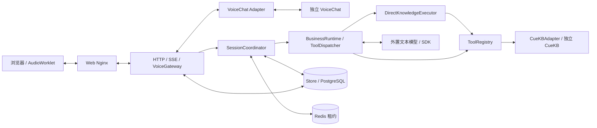

# 当前系统架构

2026-10-07 对照 `f498fa4` 代码核对。本页只维护模块职责、数据流和跨模块不变量；实现状态见 [任务板](TASK_BOARD.md)，原因见 [决策](decisions/architecture-decisions.md)。

## 1. 产品与部署边界

英文实时语音问答，客服是首个场景；当前为单组织、只读知识与每通话临时 capability。VoiceChat-11B + nemotron-labs-voicechat + WS 是独立语音系统，CueKB 是独立知识系统。本项目控制授权、任务、知识执行与交付，不训练模型、管理 GPU 或直连 CueKB 索引。

Python/FastAPI/Agents SDK 与 React/TypeScript/AudioWorklet；生产状态为 PostgreSQL，租约为 Redis。Web 镜像内 Nginx 提供 HTTPS，同源代理到 API。端口、参数、镜像和迁移只看 [部署](deployment.md)，字段与客户端行为只看 [门户协议](portal-protocol.md)。

## 2. 模块与数据流

```mermaid
flowchart LR
    UI[浏览器 / AudioWorklet] <--> Web[Web Nginx]
    Web <--> API[HTTP / SSE / VoiceGateway]
    API <--> Adapter[VoiceChat Adapter]
    Adapter <--> Voice[独立 VoiceChat]
    API --> C[SessionCoordinator]
    C --> R[BusinessRuntime / ToolDispatcher]
    R --> D[DirectKnowledgeExecutor]
    R <--> L[外置文本模型 / SDK]
    D --> T[ToolRegistry]
    R --> T
    T --> K[CueKBAdapter / 独立 CueKB]
    C <--> DB[(Store / PostgreSQL)]
    API <--> DB
    C <--> Lease[(Redis 租约)]
```

图中 Runtime/Registry 表示代码调用边界，不是新增独立服务。无工具一般回答经过 Gateway/Store，不创建知识 Turn，也不调用 CueKB/外置模型。

| 代码模块 | 职责 | 修改时读 |
| --- | --- | --- |
| `api/auth.py`、`routes.py` | 通话归属/范围、HTTP/SSE/WS、受权历史、管理隔离 | 门户协议 / 接入 §6 |
| `voice/provider.py`、`gateway.py` | 供应商事件归一化、最终输入绑定、输出许可、单写入器、背压 | 接入 §3 / 口述与交付 |
| `sessions/coordinator.py`、`coordination.py` | 唯一业务提交、幂等、epoch/revision、任务/租约、共享期限 | 本页 §3 / 上下文 / 交付 |
| `agent_runtime/` | 原生工具静态分派、直查或 SDK 推理、证据/呈现检查 | 知识执行 / 交付 §1 |
| `tools/registry.py`、`adapters.py`、`schemas.py` | 后台工具权限、版本、限时、上游契约与证据映射 | CueKB 契约 / 接入 §5 |
| `task_context.py`、`storage/`、`migrations/` | 来源条件、业务/交付/审计持久化、授权裁剪、迁移/留存 | 上下文 / 交付 §2 / 部署 |
| `apps/web/src/`、`public/` | 收音/重采样、消息合并、证据显示、独立响应播放/排空估计 | 门户协议 |

供应商原始事件仅在 voice 边界解释，Agents SDK 仅在 agent_runtime 使用。浏览器不持有供应商密钥、私有地址或执行工具的权限。

## 3. 一轮请求与状态边界

1. Start call 创建独立 owner/token 和策略快照，再签发绑定 conversation/epoch/Origin 的一次性语音票据；会话握手确认格式和原生工具。
2. Gateway 将工具 call 绑定到用户 input item，必要时有界等待最终 ASR。最终原话与有来源的确认条件决定执行输入，不能采用模型猜测的型号/版本。
3. VoiceChat 自主选择直接回答或工具。服务端按注册名分派；直查、升级、外置执行及严格模式见 [知识执行](qa-routing-design.md)。固定 ACK 与后台查询可并行，ACK 不证明查询成功。
4. Coordinator 在 epoch/revision/Turn/租约仍有效时提交结果；Gateway 在写回和输出时再次核对权限/工具版本与有效归属。先建立输出许可和交付记录，再发送工具结果，避免即时续答丢失。
5. 外置路径先提交经过检查的拟文本；D2 路径先回填证据，等待原生实际转写和音频结束后有限检查，再提交 canonical final。呈现检查、发送完成、播放估计与听到是不同证据，详见 [交付](live-agent-implementation.md)。

| 状态层 | 权威对象 | 不能推导的结论 |
| --- | --- | --- |
| 用户输入/上下文 | Utterance、最终 ASR、带来源条件 | 一般回复不是企业证据；转写相似不代表同一轮 |
| 业务 | Turn、revision、epoch、当前租约 | accepted 不意味着网络成功或已听到 |
| 结果/音频交付 | DeliveryAttempt、response/call 关联、呈现检查 | 写入和数据库无共同事务；unknown 不重发 |
| 浏览器播放 | response 队列、samples、finished 估计 | audio.done 不等于队列排空；排空不等于用户听到 |

`parent_task_id` 表示前一轮任务，不是子 Agent。提交文字会结束当前语音，不定义文字与语音并行竞争。新 revision 替换旧业务；普通发声、附和、固定 ACK 或停止播放不能自行取消业务。支持等待修订的 Adapter 还必须安全结清旧 pending call，不能只丢弃本地结果；具体控制矩阵归门户/交付文档。

## 4. 权限、并发与故障

- 有效 KB 范围取服务端授权/部署范围/受限 CueKB Key 的交集。知识与历史均作为数据，不能执行其中指令或扩大权限；历史、SSE、后续模型上下文也复核撤权。细节归 [接入 §6](integration.md#6-独立通话与知识范围d02d13)。
- 所有网络方向保持有界队列，背压/失败显式终止；上游只有一个写入器。供应商须提供有序逐轮 response/结束边界，不能凭音量、字幕相似或任意延迟猜音频归属。匹配版本见 [补丁交付](../deploy/voicechat/README.md)。
- 丢弃过期业务结果后仍须结清原生调用或关旧连接。重连只恢复授权业务摘要，不恢复录音、播放队列或模型隐藏状态。轮换等待 quiet、无待写回工具及排空/抑制，仍受有限宽限期约束。
- Redis 租约与数据库版本共同隔离多副本，粘性路由和故障恢复要求归部署；取消本地 coroutine 不证明远端 HTTP/GPU 已停止。
- VoiceChat 失败可显式使用文字入口；CueKB/文本模型错误不得伪造事实或静默回退 mock。日志不记问题/音频/凭据正文。

## 5. 演进与验收入口

能力状态仅在 [任务板 §3](TASK_BOARD.md#3-待完成与建议顺序) 维护。评估架构调整先读对应 ADR，再检查受影响调用方、契约和迁移；不要把历史目标类名当作已实现类。

Q01/Q02 剩余目标是完整恢复/语义与听音验收；Q03 是全阶段观测与报告完整性；Q04 是受权原件下载；D1/D3/其他 Provider/子 Agent 均需独立设计。原方案细节保存在 [历史架构](archive/2026-10-07/architecture.md#10-演进状态与后续设计)。实际已执行结果归 [验收报告](acceptance-report.md)，放行标准归 [验收清单](development/validation.md)。
