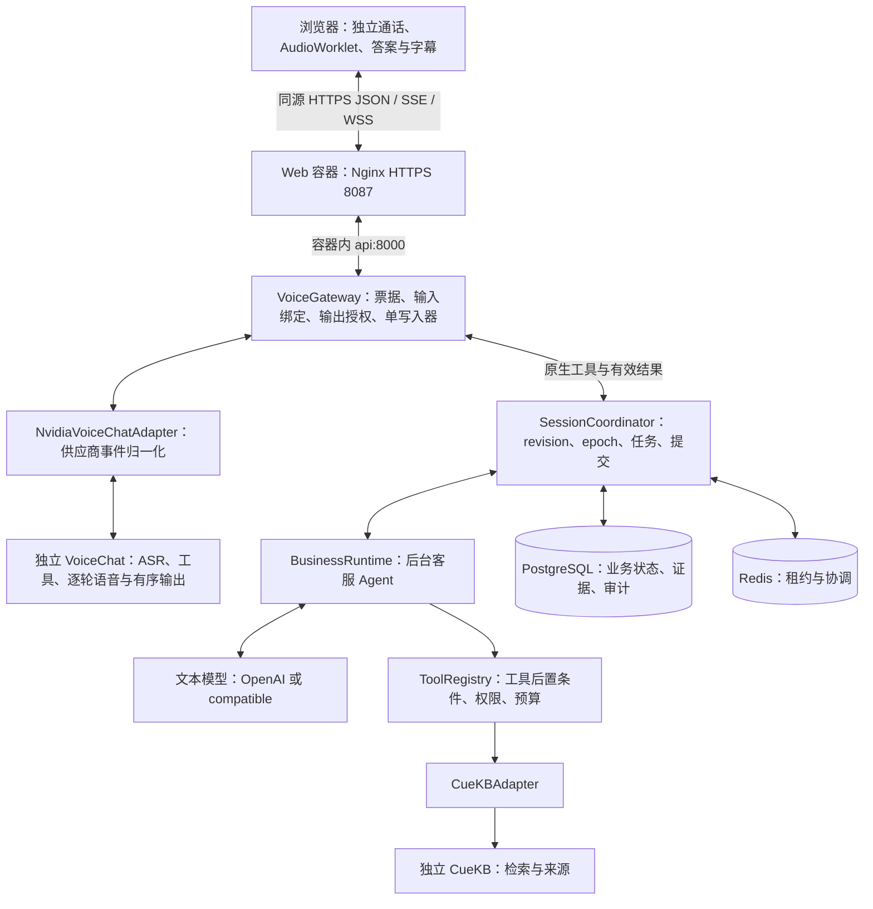

# 语音客服 Agent：架构与演进设计

更新：2026-10-02。本文定义当前产品、模块职责、语音与业务状态及故障边界。实现状态见 [任务板](TASK_BOARD.md)，验证证据见 [验收记录](acceptance-report.md)。当前设计包含 D19 的 WebSocket 输出/播放修复、D20 的原生能力边界和查询交付优化；真实识别、GPU 推理与听音仍待部署复测。§10 保留其他建议，§11 为 Q07 已确认需求的待编码规格，不与现有能力混写。

## 1. 产品定位与范围

本期提供生产级英文知识库语音客服，仅启用 `search_knowledge`。客户在门户开始独立通话，用英文提问，系统从授权 CueKB 获取证据，给出文字答案、来源及短口述。VoiceChat 负责语音感知与生成，BusinessRuntime 负责客服任务和证据回答，两者不能互相替代。

每个完整客户发言，包括问候、听不清和闲聊，都先经 `consult_service_agent` 进入后台业务入口。缺少产品型号或专有名词时按最终转写澄清，不让语音模型改写成猜测的事实。知识请求必须通过 `search_knowledge` 的服务端后置条件；空命中、证据不足、澄清和系统故障是不同结果。VoiceChat 自有常识不能成为客服答案。

门户以语音为主，文字是可选降级入口；不提供工具管理、知识上传或运维工作台。首期只读，不包含交易、订单修改、自动退款、天气/股票或正式人工坐席转接。中文、正式客户登录、跨组织完整多租户及子 Agent 调度均不在本期。默认单组织部署，知识范围由服务端确定。

本项目不训练模型、不管理 GPU 调度。独立 `speech` 源码中的 WebSocket 协议修复随独立 VoiceChat 镜像交付；它不成为本项目的 Python 依赖或新服务。修改前后供应商代码版本必须进入发布基线。

## 2. 总体架构

本节及 §4 描述当前已实现的外置 LLM 流程。2026-10-02 已确认外置 LLM 可选化需求；目标架构和可直接执行的编码规格以 [§11](#11-q07外置-llm-可选化实施规格尚未编码) 为准。尚未编码，不能按目标配置运行当前版本。


```mermaid
flowchart TB
    U[浏览器：独立通话、AudioWorklet、答案与字幕]
    W[Web 容器：Nginx HTTPS 8087]
    G[VoiceGateway：票据、输入绑定、输出授权、单写入器]
    C[SessionCoordinator：revision、epoch、任务、提交]
    V[NvidiaVoiceChatAdapter：供应商事件归一化]
    N[独立 VoiceChat：ASR、工具、逐轮语音与有序输出]
    B[BusinessRuntime：后台客服 Agent]
    L[文本模型：OpenAI 或 compatible]
    T[ToolRegistry：工具后置条件、权限、预算]
    K[CueKBAdapter]
    Q[独立 CueKB：检索与来源]
    S[(PostgreSQL：业务状态、证据、审计)]
    R[(Redis：租约与协调)]
    U <-->|同源 HTTPS JSON / SSE / WSS| W
    W <-->|容器内 api:8000| G
    G <--> V <--> N
    G <-->|原生工具与有效结果| C
    C <--> B <--> L
    B --> T --> K --> Q
    C <--> S
    C <--> R
```

本项目、VoiceChat、CueKB 独立部署。文本模型是 BusinessRuntime 的推理依赖。浏览器只访问本项目同源入口，不获取供应商地址、密钥或原生工具执行权。天气等既有扩展适配器保留代码但本期不注册开放。

### 2.1 模块职责

| 模块 | 负责 | 不承担 |
| --- | --- | --- |
| 门户 / VoiceClient / AudioWorklet | 通话、收音、重采样、PCM 播放、字幕、状态和引用 | 知识权限、业务推理、供应商工具选择 |
| VoiceGateway / Adapter | 票据与会话 fence、输入 item 绑定、工具往返、输出授权和背压 | 生成企业事实、把整场连接永久授权为一个回答 |
| SessionCoordinator | 任务幂等、revision/epoch、取消、租约与业务提交 | 操作供应商隐藏状态 |
| BusinessRuntime | 理解最终 ASR/文字请求、澄清、知识工具和有据回答 | 自行授予权限、直接播放音频 |
| ToolRegistry / CueKBAdapter | 参数/结果契约、服务端凭据、范围、限时和证据映射 | 接受模型指定的 endpoint 或扩大 KB 范围 |
| 独立 VoiceChat | 流式 ASR、原生工具、ACK/回答语音、每轮 response 和有序发送 | 用常识绕过业务工具、把音频包数量当作听音成功 |
| CueKB | 授权检索、知识来源、版本与上下文 | 语音交互、替应用判断全部回答断言是否充分 |

沿用 `apps/api/app/{api,voice,sessions,agent_runtime,tools,storage}`。供应商结构只在 `voice/` 内归一化；Agents SDK 限于 `agent_runtime/`。本项目不直连 CueKB 数据库或索引。

### 2.2 技术与部署选择

后端为 Python 3.12/FastAPI/Agents SDK，状态存储 PostgreSQL，协调 Redis；依赖使用 pip 与固定版本 requirements。门户为 React/TypeScript，AudioWorklet 实现持续重采样和有界播放队列，不另建逐帧 AudioBufferSource 播放器。

Web 镜像内置 Nginx，标准部署直接提供公网 HTTPS `8087`，仅把同源 `/api/` 转发到容器内 API `8000`；API/数据库/Redis 不映射公网端口。现场入口若为 `9002`，需按实际域名、TLS、端口和反向代理核对 `PUBLIC_ORIGIN`，不能从端口推断它直连 VoiceChat。服务端到独立服务的受控内网 HTTP/WS 与浏览器 HTTPS/WSS 是不同连接。详见 [部署](deployment.md)。

## 3. 门户与标准消息接口

客户端契约是本项目的 `/api/v1` 和 `portal.*`，使用 HTTP JSON、SSE 和 WebSocket，不直接暴露 NVIDIA/OpenAI 事件。

| 通道 | 用途 |
| --- | --- |
| HTTPS JSON | 创建独立 conversation/call capability、申请票据、文字输入、停止/取消/结束 |
| SSE | 持久业务进度、经验证答案和历史恢复 |
| WSS | 连续音频、实时用户转写、实际口述文字、播放进度与错误 |

Start call 创建当前标签页独有的 conversation、owner 和短期 token；token 只保存在标签页内存。ready 表示语音握手和格式已确认，不表示已有问候或业务答案；连接初始自行生成的欢迎语被抑制。用户实时字幕在完成态后保留到持久 voice Turn 接管；实际口述字幕与业务答案分别展示。详情见 [门户契约](portal-protocol.md)。

## 4. 端到端调用流程

### 4.1 一次语音知识问答

1. 开始通话创建独立 capability，申请一次性、绑定 owner/conversation/epoch/Origin 的 WS ticket；VoiceGateway 连接 VoiceChat，完成 `session.created → session.update → session.updated` 后发 portal ready。
2. AudioWorklet 按 AudioContext 实际采样率重采样为 24 kHz、单声道 PCM16，每 80 ms 发送 3840 bytes，包括静音。48 kHz 采集与 VoiceChat 内部 16 kHz 推理都不改变这个线上协议。
3. VoiceChat 先发用户 input item 的开始/最终 ASR，再发原生工具事件；同一推理批次内，ASR/工具必须排在 ACK 音频之前。空闲 codec 音频不能创建持续整场的 response。
4. 网关将工具绑定到尚未消费的 input item，按 call_id 去重并验证参数；最终 ASR 是业务请求的权威文本。工具先于 ASR 完成时有界等待；无有效输入的工具只结清，不创建 Turn。最终 ASR 不额外启动第二次查询。
5. Coordinator 建立受 revision/epoch/租约保护的 Turn；Runtime 在整轮预算内调用文本模型、ToolRegistry 与 CueKB `/v1/search`。KB 范围来自服务端，知识检索与答案状态由服务端校验。
6. 业务答案通过有效性检查后提交，提交完成通知本机 SSE，门户直接更新已有 Turn；跨进程仍按持久游标补查，未知 Turn 才读取历史。VoiceGateway 单写入器在写回前再次核对 call、turn、revision、epoch 和租约，用原生 call_id 回传工具结果。
7. 工具 ACK 和最终回答分别结束自己的音频 response；固定 ACK 不得提前消耗后续答案的授权。若供应商在原 response 内返回最终答案，则在完成时撤销未使用的后续许可。新输入活动不撤销仍有效的已授权回答，但未桥接的直接回答必须拒绝。
8. VoiceChat 将音频、字幕和完成事件按生产顺序发送，排队事件携带原 response ID；尾部重采样和 PCM 残帧先发送，再发 audio.done。浏览器在实际队列排空后才清除当前播放身份，播放 ACK 只是估计。

### 4.2 工具与子 agent 的取舍

保留 **VoiceChat 统一业务工具 → BusinessRuntime → CueKB Tool**。后台 Runtime 已承担被委派的客服任务；简单知识检索不另加一个只负责转发的 LLM。`parent_task_id` 记录前一轮任务，不代表子 Agent。

未来只有复杂跨文档样本证明收益时才评估一层 KnowledgeAgent。子任务只返回候选证据，由 Coordinator 统一提交；不直接写会话或播放音频。现有 `submit()` 会替换当前任务，不能把它当作子任务调度器。增加 Agent 不能解决供应商工具等待期间的交互限制。

### 4.3 第三方与文字入口

文字输入复用同一 Runtime/ToolRegistry 和知识范围，提交文字会终止当前语音，门户须提示该行为。未定义话轮竞争规则前不并行提交文字与语音任务。

未来第三方查询仍通过既有工具边界，单独约定身份、时效、字段、预算和验收；本期不开放天气/股票，也不以旧知识或模型常识冒充实时结果。

## 5. 全双工、改问与工具生命周期

### 5.1 三个独立状态

| 状态层 | 含义与边界 |
| --- | --- |
| 连接和播放 | 连接 ready 不等于有答案；清空当前播放不等于结束会话；audio.done 不等于扬声器队列已排空 |
| 业务任务 | revision 控制当前请求；Turn 有运行、回答状态及 canceled/expired/superseded；epoch 隔离音频连接 |
| 结果交付 | pending_validation/accepted/discarded 描述业务接受；供应商写回、实际口述、播放估计分开记录 |

`accepted` 不证明客户听到。当前已有字幕和 playback_ack 持久化，但完整交付台账仍属 §10.1。`task_id` 对应 Turn，`parent_task_id` 不是子任务父节点。

| 用户行为 | 业务处理 | 音频处理 |
| --- | --- | --- |
| 普通发声/附和 | 不单凭 speech_started 取消任务 | 保留模型声学让话，不额外自动清音；授权按 response 判断 |
| Stop playback | 保留仍有效业务查询 | 立即清队列、抑制被停止 response；后续合法回答仍可播放 |
| Cancel search | 推进 revision，使旧任务失效 | 不播放晚到旧答案；必要时关闭无法结清的原连接 |
| 改问/新条件 | 原任务 superseded，创建新 revision | 只交付仍有效版本 |
| 结束/硬打断/断网/失权 | 撤销提交和写回权、释放资源 | 禁止播放、清旧队列、停止麦克风；旧 epoch 不可恢复 |

浏览器的播放许可与清队列分开：同 epoch 清音保留会话许可，失效/关闭才持续 suppressed。停止时即使服务端已发 audio.done，只要本地仍有缓冲，仍发送该 response ID，不能误抑制下一轮。

### 5.2 结果接受与原生调用结清

每次工具绑定有效输入、任务版本、授权范围、deadline 和 native call。业务提交和语音写回各执行一次 fence；只取消本地等待不代表外部 HTTP 或 GPU 推理已终止。

丢弃旧业务结果后仍须结清原生 pending call。仅在原连接和协议允许时返回失效说明；否则关闭旧连接，不能把旧 call_id 写到新连接，也不能以立即返回“已受理”冒充可在未来任意推送答案。

当前业务适配采用有序逐轮 response。原生 HTML 连续播放、不依赖 ID，能正常工作不等于满足本项目的逐轮抑制契约；当前 speech 基线只更新 WebSocket 传输层，不修改推理模型。不能在 adapter 把可能早于缓存 PCM 的 transcript.done 猜成 audio.done。原生 call response 可以承载固定 ACK，合法工具结果最多授权随后一个新 response；固定 ACK 的精确文本来自 adapter 配置。授权被消费或最终回答结束后必须回收，不因整场连接还在就持续有效。初始被抑制 ID 的一段文字已完成、尚未收到 audio.done，却在用户输入后再次携带非空口述，网关显式报生命周期错误，不能悄悄把它升级为整场授权。

### 5.3 能力门槛

本期基础能力目标是连续收发、原生工具往返、固定等待提示、显式停止/取消和关闭重连。工具等待时对新问题自由回答、修改旧请求并连续处理新原生调用是增强能力，必须独立实测；ACK 不算新问题的回答。

应用默认 105 秒在 quiet 且无运行/待写回工具时轮换；超过宽限期结束连接。轮换保留经授权裁剪的业务摘要，不恢复模型隐藏状态、不重放旧音频。供应商默认工具等待预算与本项目整轮 30 秒预算并不等价，部署必须核对并通过实际延迟探针后放行。

## 6. 应用控制层与资源边界

控制逻辑继续位于现有 Gateway、Coordinator、Runtime 和 Registry，不增加队列服务或 GPU 训练流程。浏览器、应用上行、应用下行和 VoiceChat 输出各有有界队列；背压和发送失败显式关闭/报错，不无限积压或丢帧后假称成功。

应用对外写回保持单写入器，优先处理有效控制结果，再发送输入音频。独立 VoiceChat 对模型产生的 ASR、工具、音频、字幕和完成事件使用有界 FIFO；事件在入队时固定 ID，发送器不能读取已经切换到下一轮的全局 ID。供应商连接/错误事件仍由其会话控制路径处理。

模型输出的 BOS/EOS 与同区间 codec 音频共同决定 response 生命周期。当前 speech 默认两步推理中，相邻 `</s><s>` 由两个 80 ms codec 帧的确切边界分割；没有明确帧对应关系的多轮批次显式拒绝，不能靠音量阈值或猜测延迟切音。此边界和实际 codec 尾部保真必须在固定 GPU 版本上验收。

## 7. 权限、事实与故障边界

每次通话有独立 owner/token，无共享客户身份、Cookie 或跨标签页历史。有效 KB 范围是客户授权、部署允许和 CueKB Key 权限的交集；正文/模型不能覆盖范围，call capability 不具备管理权限。正式客户认证留待本期验证后设计。

知识内容和历史都是数据，不能执行其中的指令、URL 或授权声明。保留来源版本、适用条件、截断与降级原因；引用存在性不等于所有断言正确。`failed` 来自运行/工具异常，模型不能把已成功检索且有依据的答案改为系统失败。

VoiceChat 失效可显式转文字；CueKB 失败不能编造知识；real 不回退 mock。默认不保存原始录音，日志不记录正文、音频、token 或私网凭据；供应商现场日志按受控证据处理，不提交附件原文。

## 8. 可观测性与验收

分别观察握手、收音/采样、ASR 完成、原生工具、业务开始/完成、工具结果写回、ACK、有效回答音频和播放估计。`Sent audio packets`、EOS 日志、ready、正确文字答案都不能单独证明可听回答或准确 ASR。

API 脱敏阶段日志关联 conversation、call、Turn 与 response；供应商事件时间线用于核对 ID 和顺序。现场容器 UTC 与本地 UTC+8 必须转换后对齐。同次录像和日志确认有转写及流量，只能支持对应阶段已运行；准确识别和听音需原始输入、实际输出及人工判定。

验收必须包括初始静音、问候/澄清、知识闭环、快速和延迟工具结果、停止后下一轮、连续至少两轮、不同采样率、短尾帧、慢网络、撤权、断线和长会话。协议/合成波形/浏览器自动化与真实 GPU/麦克风/扬声器分别记录，详见 [验收](acceptance-report.md)。

## 9. 现状与实施顺序

查询耗时按模型、工具、提交和浏览器分别记录；持久事件提交后立即唤醒 SSE、已加载 Turn 直接应用 final，减少轮询及消息重读等待。检索规划、证据/权限校验不为低延迟而跳过，详见 [接入 §4.1](integration.md#41-查询延迟与优化边界)。

当前状态由 [任务板 §1–3](TASK_BOARD.md#1-当前结论与审计基线) 唯一维护。D19 同步修改本项目和用户确认同源的独立 speech；本项目发布 API/Web，当前确认的 speech 基线同步更新 WebSocket 文件并设置 Jinja。该要求针对本项目严格音频归属，不能泛化为原生对话/插话必需修改模型。先核对版本与静音/两轮工具事件，再做实际英文 ASR、CueKB 和听音复测，最后评估增强交互与性能。

## 10. 建议优化设计（尚未实施）

以下方案来自当前仓库实现核对，保持现有边界，不新增服务。Q01–Q03 可先在编码环境用契约和夹具实现；真实效果在 D07 验证。Q04 属于接入主题，见 [原件查看设计](integration.md#7-q04原件查看的后续设计)。

### 10.1 Q01：交付记录与恢复语义

**现状与问题。** `Store.commit()` 将业务结果置为 accepted 并发布答案；`VoiceGateway.upstream_writer()` 回传工具结果后仅更新内存 pending 状态。字幕和 playback_ack 已入库，但缺少将业务提交、供应商写回、播放估计汇总的持久交付记录。连接丢失后不能从 accepted 推断是否已送出或播完。

**设计。** 保留 `Turn.delivery_status` 现义，新增内部交付记录（字段名在实施时冻结），以 turn、epoch、native call 和交付尝试标识去重。分别记录业务接受、工具结果发送尝试/成功返回、失败或未知、播放抑制及最终断线原因；播放估计仍按 response_id 保存。仅在供应商协议有明确映射时关联 call 与 response，缺映射时保持未关联，不用相似文本或时间接近猜测。

**调用与一致性。** Coordinator 仍唯一提交业务；网关在单写入器最终 fence 后记录发送尝试，外部 I/O 后补记结果。数据库与 WebSocket 不存在共同事务，崩溃窗口一律 unknown；重启不盲重发工具结果或音频。记录失败不得绕过 epoch/revision/租约校验。轮换摘要继续经过授权裁剪，并明确“答案已生成、播放未知”，不得声称用户已听到。

**影响与验收。** 修改 `storage/models.py`、`store.py`、`voice/gateway.py`，新增 Alembic 迁移；默认只供内部审计，若新增公开字段则同步版本化契约。用写前失败、写后断线、重复回调、撤权、旧 epoch、清音、进程恢复夹具验证幂等与 unknown；D07 再核对实际音频。旧数据缺少交付证据时按 unknown 读取，不回填为成功。

### 10.2 Q02：证据充分性与口述质量

**现状与问题。** `BusinessRuntime.validate()` 已拒绝伪造引用、失效工具、无证据的肯定回答及明确不安全状态；M3 支持逐块/关系/截断信息。它并未逐条证明回答断言由引用支持，`unassessed` 也不等于充分；ASCII 合法仅是传输约束，不保证型号、数字或否定条件口述正确。

**设计。** 先建立受控回归集：单文档支持、版本冲突、supports/refutes、缺型号需澄清、上下文裁剪后缺条件、空命中和服务错误。逐例保存预期业务状态、应保留的条件、允许引用及禁止断言。沿现有 Runtime 加强“缺关键条件先澄清、冲突不确定则无依据”的输出校验；供应商状态仍通过 Adapter 映射，不把 relations 立场当事实判决。仅有 citation_id 不能判定语义通过。

**口述策略。** 展示答案保留完整来源，短口述保留结论所必需的型号、版本与否定条件。当前降级提示拼接后按 160 字符截断，需回归检查是否切断条件；后续改成按完整语义句生成/验证短口述，装不下则明确引导看门户。非 ASCII 路径继续显式文字降级，不静默删改专有名词。是否增加二次模型校验，须经固定样本收益、成本和时延对比后决定。

**影响与验收。** 主要为 `agent_runtime/runtime.py`、相关契约测试和英文样本；不修改 CueKB 索引或新增 KnowledgeAgent。文本夹具验证处理规则，真实英文录音由 D07-C 人工核对实际口述；分开报告检索、文字与语音正确性。不能用模型自评分或正确文字答案替代听音。

### 10.3 Q03：可观测性与报告完整性

**现状与问题。** 已有业务事件、工具记录、字幕/播放估计、日志凭据脱敏及保留期清理；缺少统一运行指标与端到端分阶段报表。`score_voice_evaluation.py` 只对 real_service 且具有有效观测值的行逐指标统计，不检查预期样本全集、版本一致性或全部 V 项是否覆盖。

**设计。** 在既有网关、Coordinator、Registry 边界记录阶段时间和失败原因：检索、Runtime、工具结果写回、等待提示首音频、有效答案首音频、停止播放。延迟用单调时钟；只有明确关联的回答才进入有效首音频统计，缺映射标缺测。指标只按部署/模式/工具/错误码聚合，不以用户、会话或 call ID 作高基数标签；追踪 ID 仅留受控日志，不记录原始音频、正文或凭据。

**报告。** 基于预期 case 清单生成总数、已执行、缺测、失败、不适用及原因；逐指标保留原有有效观测分母，同时校验重复/未知 case、real_service、应用/供应商版本和证据关联。语音探针使用合成工具结果，只能证明协议候选能力，不能记作真实 CueKB 闭环。P50/P95、超时与错误率按实际并发和样本数量报告，不由少数样本宣称 SLA。

**影响与验收。** 扩展现有记录点与评分脚本，采集出口依部署现有运维设施确定，不默认增加遥测服务；新增报告输入需有版本及旧报告兼容策略。夹具覆盖缺测、重复 ID、混合版本、无有效样本、敏感字段；D07-E 检查开销和容量，D07-F 用报告核对放行。阈值在真实基线测量后冻结，再以独立复测样本验收。

### 10.4 Q05：VoiceChat 论文与离线容器优化设计

2026-09-28 的[专项分析](voicechat-research-review.md)基于 arXiv:2609.21967v1、官方容器文档、D19/D20 与本机 speech 源码。用户已完成 HF checkpoint 到 Triton Model Repository 的转换；不重复转换或改变现有服务边界。优先评审工具等待阶段的能力限制、跨服务 deadline、ACK/结果注入、口述质量、音频背压与既有轮换恢复。Q05 为设计待确认，未实施；其中工具等待期间自然语音改问需要独立推理层能力验证，不能以普通对话的全双工能力替代。

### 10.5 Q06：语音文字统一聊天展示

2026-09-29 的[门户 Q06 契约 §7](portal-protocol.md#7-q06语音文字统一聊天展示)已完成本地编码：ASR 立即进入右侧用户气泡，与后台查询并行推进；实际口述进入左侧无背景正文，音频结束后保留。临时输入与持久 Turn 以 `input_item_id` 原位接管，完整业务答案和引用单独展开。沿用当前模块、通话隔离和取消边界；真实 VoiceChat/CueKB、设备体验和撤权现场复测仍待 D07。

## 11. Q07：外置 LLM 可选化实施规格（尚未编码）

### 11.1 需求、优先级与设计结论

日期：2026-10-02；审计代码 `bbbd95e`。用户已确认需求，本节是后续编码的确定性规格；本轮只编辑 Markdown。实施者先核对增量差异，按 §11.9 执行，不重新选择模式开关、模型职责或交付状态。

- 未配置外置 LLM：VoiceChat 内部 Nano LLM 负责检索问题形成、证据理解、澄清和最终回答；应用后端只执行确定性的控制、授权、检索及证据整理，不调用任何外置生成模型。
- 配置外置 LLM：保留当前模型规划 → CueKB → 模型生成结构化答案 → 校验提交 → VoiceChat 口述的流程，包括文字入口。
- 全局模式在 API lifespan 启动时解析、校验和装配一次。一个进程只能使用一种模式；无按请求配置判断、后台自动探测选路、热切换、自动降级或基于问题复杂度的混合路由。
- 保留 VoiceGateway → SessionCoordinator → BusinessRuntime → ToolRegistry → CueKB，以及独立 speech/VoiceChat 服务。BusinessRuntime 是业务执行边界，不等于必须调用外置 LLM。
- 本需求明确替代 §4.2、接入 §4.1、Q05 中“始终保留外置模型检索规划”的目标约束；这些段落仍准确描述当前实现和未来 external 模式。权限、取消、英文本期范围及协议边界不变。

逻辑路径如下（文字箭头只表示依赖，不规定线程）：

```text
启动：Settings → 校验 AGENT_PROVIDER → 固定 ExecutionProfile → 注入 Runtime / Coordinator / Gateway

external：VoiceChat → bridge → Coordinator → BusinessRuntime（外置 LLM → Registry → CueKB → 外置 LLM）
          → 校验后的 AnswerBundle 提交 → 同 call 工具写回 → VoiceChat 口述

direct：  VoiceChat / Nano → bridge（检索问题）→ Coordinator → BusinessRuntime（Registry → CueKB）
          → KnowledgeBundle 证据提交 → 同 call 工具写回 → Nano 理解并口述
          → 已授权转写与 response 完成 → Coordinator 提交最终口述记录
```

### 11.2 全局配置和启动装配

唯一开关沿用 `AGENT_PROVIDER`，扩展枚举为 `none | openai | compatible | mock`，默认从 `mock` 改为 `none`。不新增 ENABLE_LLM、自动模式或第二份部署配置。空白 provider 归一化为 `none`；其他非法值失败。模型名、Key、可选 URL 去掉首尾空白后判空。URL 均要求 host，拒绝 userinfo/query/fragment 和非 HTTP(S) 协议；compatible 示例以 /v1 结束，不把 /chat/completions 当 base URL。openai 的自定义 base URL 保留现有兼容能力，不强制其路径为 /v1。

| 启动输入 | 固定模式 | 启动行为 |
| --- | --- | --- |
| provider 缺省/空/none，AGENT_MODEL、OPENAI_API_KEY、AGENT_BASE_URL 全空 | direct | 不要求模型凭据，不构造 AsyncOpenAI 或 SDK Agent/Runner，不探测模型服务 |
| provider=openai，MODEL/KEY 非空 | external | 现有 Responses 路径；BASE_URL 可空，非空则校验为合法 HTTP/HTTPS 基地址并按现有 client 传入；缺 MODEL/KEY 失败 |
| provider=compatible，MODEL/KEY/BASE_URL 非空 | external | 现有 Chat Completions 路径；base URL 为含 host 的 HTTP/HTTPS `/v1` 基地址；缺项或格式错误失败 |
| provider=none/缺省，但任一模型连接项非空 | 无 | 配置冲突，启动失败，明确提示设置 provider 或清空残留项；不得猜测用户意图 |
| provider=mock | fixture | 仅显式注入测试 Settings 时可用，生产继续拒绝；不会因缺配置自动进入 mock |

已有生产 `.env` 显式设置 openai/compatible，可继续使用原流程。新模板默认 none、模型参数留空，给两种 external 模式完整注释示例。`AGENT_DEADLINE_MS` 和 `MAX_AGENT_RUNS` 保留名称，成为全局业务执行预算/容量，不因 direct 模式失效。

在 `config.py` 定义不可变 `ExecutionProfile`（frozen dataclass 即可，非插件框架），字段至少为 `mode: direct|external`、`agent_provider`、`text_available`。业务模式解析和组合校验即使注入测试 Settings 也执行；只有生产基础设施/real provider 门禁由测试注入绕过。fixture profile 映射 external 的测试执行器，并显式报告 is_mock。

在 `agent_runtime/runtime.py` 保留 `BusinessRuntime` 外观，构造时绑定实际 `run`、`failure`、`close` 实现；现有 SDK 实现移至同目录 `external.py` 的 ExternalLLMExecutor，direct 实现放 `direct.py` 的 DirectKnowledgeExecutor。不得复制 Registry/Adapter、授权逻辑或检索结果映射。external 的 provider/model/client/model class/prompt 都在构造时固定，删除每次 run 对 provider 的选路。direct 不初始化外置客户端；依赖包暂时保留，支持同一镜像运行两种模式。

`main.py` 在数据库/服务接受请求前构建一个 profile，传给 Runtime、Coordinator、Gateway 及 capabilities 生成器；退出调用统一 runtime.close()。`voice/provider.py` 的模式提示词、bridge schema 和结果序列化策略也在启动时选定并加载。每次连接只拼接经授权的会话摘要，不重新读取 prompt 文件或环境变量。request 路径调用已绑定策略，不写 `if settings.agent_provider ...`；权限、channel、输入类型、状态和 deadline 的每次校验仍然必要，不属于重新选择全局模式。

多副本由同一次发布提供相同 `.env`，启动日志/readiness 暴露非敏感 mode/provider；部署核对所有副本一致。变更模式需要 drain、结束旧通话并重建/重启 API，不能让同一场实时通话跨模式迁移；无需新增配置中心。

### 11.3 Runtime 输入、结果及模式职责

内部增加 `BusinessInput`，包含 `user_text`（最终 ASR 或原文字）、`knowledge_query: CueKBSearchInput | None`。它不含 NVIDIA event、凭据、KB 列表或 endpoint。`RunContext` 保留原有权限、工具版本、证据和 revision/epoch；provider 协议到 BusinessInput 的转换只在 voice 层。

- external：沿用 BridgeArguments(user_request)，最终 ASR 是 user_text，knowledge_query=None；历史和已确认 slots 继续交给现有 Agent。输出仍为 AnswerBundle；两次典型模型调用、必需知识工具和最终校验不变。
- direct：使用接入 §8 定义的 NanoBridgeArguments；最终 ASR 仍是用户消息的权威文本，独立 query 可做上下文补全，但不是转写。只调用一次 `registry.invoke("search_knowledge", ...)`，不在 backend 写自然语言意图分类器或字符串检索规划器，不增加自动二次检索循环。Nano 根据结果回答、澄清或请用户补充后进入新轮。
- 两种实现共用工具准备（allowed_tools/tool_versions）及最终工具版本/权限复查。direct 也必须经过 Registry 的 deadline、当前任务检查和 ToolRun 审计，不能直接调用 CueKB HTTP client。
- 当前所有完整发言均须走合法 bridge 的策略保留；不新增问候/常识免工具路由。direct 不额外引入意图枚举。无法解释的问题允许 Nano 在一次检索后澄清，质量归 D07；不以关键词猜意图跳过权限路径。

新增严格内部/持久模型 `KnowledgeBundle`，独立于 AnswerBundle，字段与 wire 投影见接入 §8。Runtime 返回 `AnswerBundle | KnowledgeBundle`；这是明确的结果类型处理，不是读取配置选模式。正常 direct 检索、未命中、上游错误均返回 KnowledgeBundle；通用运行异常可返回现有失败 AnswerBundle，由已绑定 direct serializer 转成固定失败工具结果。

证据投影必须在持久提交之前完成。VoiceProfile 在 voice/provider.py 提供纯函数 `prepare_reply(result) -> PreparedReply(result, tool_output)`：direct 校验/裁剪候选 KnowledgeBundle，返回实际待发送集合和一次编码好的 JSON 字符串；external 保持现有四字段回传与 ASCII 失败保护，不改业务 bundle。Coordinator 通过启动注入的函数调用它，只持久化 prepared.result，ready 交付 PreparedReply；Gateway 单写入器原样发送 tool_output，不再二次裁剪/序列化。PreparedReply 是内部 dataclass，不导出 API，tool_output 对业务层是不透明字符串，NVIDIA 事件封装仍只在 Adapter。禁止先提交全证据、后在 Gateway 删除其中一部分而不更新持久结果。

### 11.4 两阶段交付与任务生命周期

当前 execute() 在 Runtime 返回后立即提交答案并释放 task；direct 不能照搬，因为证据不是最终回答。采用同一个 Coordinator 执行 task 分两阶段，不增加队列服务/子 Agent。

新增内部 `TurnExecution`：`task`（完整业务执行）、`ready`（可写回原生工具的 Future）、`voice_completion`（direct 等待最终口述的 Future）。这些 Future 只用于活跃进程协调，持久真相仍是 Turn/Event/Record。`tasks[cid]`/`all_tasks` 继续跟踪完整 task，direct 等待 Nano 时仍占业务容量。`submit()` 返回 `(turn, ready_future)`；文字 route 仍忽略第二项，Gateway 等 ready 而非等待整个 direct task，避免“工具结果等待回答、回答等待工具结果”的死锁。重复 idempotency key 沿用 `(existing_turn, None)`，不得重发已发送的原生结果。

external 的执行顺序不变：run → validate → Store.commit/portal.answer.final → resolve ready → task 完成。新增 Future 只改变内部交接，不提前交付未校验答案。

direct 的精确时序：

1. final ASR 与合法工具绑定；创建 Turn，status=running，execution_mode=direct；task/ready/voice_completion 必须先注册，再允许向 Gateway 暴露结果。
2. Runtime 执行检索并返回 KnowledgeBundle；复查 lease、epoch/revision、工具版本和权限。
3. 先调用已绑定 prepare_reply，再单事务 `Store.commit_knowledge` 写入投影后的 `Turn.knowledge_result`，status=awaiting_voice，delivery_status=evidence_ready；发持久 `portal.knowledge.ready`。不写 `Turn.answer`，不发 `portal.answer.final`，不把证据文本塞进 assistant history。
4. 事务提交后 resolve ready。Gateway 单写入器再次 fence，经相同 call_id 发送结果；成功后 CAS 更新 delivery_status=tool_submitted，不得覆盖已产生的终态。重用现有固定 ACK 和至多一个后续答案 response 授权。
5. 接受属于该 Turn、已写回工具结果之后、phase=answer 的 `speech_text.done`，按 `(response_id, segment_index)` 去重持久化 Record；delta 只用于实时展示。固定 ACK 不计入答案。多片段按 segment_index 拼接；聚合上限 8000 字符，超限报 VOICE_ANSWER_TOO_LARGE、终止该轮并关闭连接，不静默裁剪成完整答案。
6. 匹配的 `audio.done` 且 phase=answer、至少一个非空已定稿口述片段到达时，Gateway 调用 `coordinator.complete_voice(...)` 仅提交完成信号，不同步等待 task 完成；从持久 Record 重读已接受片段，不能信任客户端传入文本。只有 speech_text.done 不能声称 response 音频已结束；只有 audio.done 而无文字，返回 VOICE_ANSWER_MISSING。
7. task 被完成信号唤醒，再查 lease、Turn、epoch/revision、工具版本和当前授权；同一事务写最终 AnswerBundle、Turn 终态、经授权 history 和 `portal.answer.final`。最终文本来自实际口述，不运行第二次模型或语义分类器。完成 Future/计时器/映射并释放容量。

完成信号以 turn/revision/epoch/response 绑定，幂等、只能完成一次；早到信号由已注册 Future 接收，不丢失。ACK 的 audio.done、重复 done、其他 response、旧连接输出均不能完成 task。audio.done 表示生成端音频结束，不代表用户已听到。

Coordinator 的接口固定为 `complete_voice(cid, epoch, revision, turn_id, response_id) -> bool` 与 `fail_voice(cid, epoch, revision, turn_id, reason_code) -> bool`，仅校验绑定并完成相应 Future，不等待完整 task。execute 中从该 Turn 的已授权 done Record 聚合文本，复查后调用 `Store.finalize_voice(cid, epoch, revision, turn_id, bundle, history) -> bool`；重复信号返回 false。`Store.commit_knowledge(cid, epoch, revision, turn_id, knowledge) -> bool` 只接受 running，finalize_voice 只接受 awaiting_voice；通用执行异常发生于证据提交前时沿用 Store.commit 的 failed 分支，不伪造 knowledge.ready。

写回期间标记 pending=sending，provider send 设 2 秒上限，成功后再置 sent 和放行结果后的回答。若上游极快输出早于 send await 返回，receiver 把该 call 的待归类输出暂存至多 16 个事件，send 成功后按原序处理；失败或超限关闭连接并 fail_voice，不能在 sending 阶段把新答案误当 ACK 丢弃，也不能提前给未成功写回的 call 永久授权。原固定 ACK 可按已有精确规则继续处理。该缓冲仅解决写回竞态，不替代现有音频背压队列。

### 11.5 状态、取消、超时和历史

| 路径/条件 | Turn.status | 交付与处理 |
| --- | --- | --- |
| external 正常 | running → 现有终态 | 继续使用当前 AnswerBundle/accepted 语义 |
| direct 正常 | running → awaiting_voice → voice_completed | 只表示口述生成完成，不表示逐句事实验证通过 |
| direct 明确未命中/证据不足/澄清 | running → awaiting_voice → insufficient_evidence / needs_clarification | 状态来自服务端检索事实和 directive，不从口述文字猜测 |
| direct CueKB/工具失败 | running → awaiting_voice → failed | 允许 Nano 口述失败提示，不能变成无资料/成功；reason_code 保留工具错误 |
| 执行异常/生成超时/断线 | running 或 awaiting_voice → failed | 固定可理解提示，delivery_status=voice_failed（若已进入语音阶段）；保留已接受的证据/片段，非完整回答 |
| 明确取消/替换/lease 恢复 | running 或 awaiting_voice → canceled/superseded/expired | revision/epoch fence，关闭尚未结清或仍在生成答案的旧连接 |

`voice_completed` 是新增 AnswerBundle.status，AgentAnswer 枚举不扩展，外置模型不能输出它。AnswerBundle 新增 `answer_origin: business_runtime|voicechat`（旧行默认 business_runtime）和 `evidence_role: cited_sources|retrieved_context`（旧行默认 cited_sources）；二者是来源/用途标识，不是事实正确性认证。direct 成功使用 voicechat/retrieved_context，citations 放提供给 Nano 的证据集合，不能宣称 Nano 逐条引用过。具体终态映射见接入 §8。

统一定义活动状态集合 `{running, awaiting_voice}`，替换 Store.begin_turn/invalidate/rotate_voice/cancel_task、Coordinator.recover/ensure_owner、管理员 drain 相关判断及前端取消按钮中只认 running 的地方。`Store.commit` 保持 external 行为；新增 `commit_knowledge` 和 `finalize_voice` 以 CAS 接受指定前置状态，不粗暴放宽旧 commit 的条件。Store.current 仍检查当前轮和 revision/epoch，输出还需已授权 response/模式生命周期检查，不能仅靠 status。

- direct 总预算从 execute 开始计时，继续使用 `AGENT_DEADLINE_MS`（默认 30000），覆盖检索、证据提交、写回和等待 Nano 完整 response；不得在阶段切换时重置。工具仍受 5 秒独立上限。external 的现有预算范围不变。无新增可调超时参数，后续有真实证据再调整。
- 超时先 fence 当前 direct 输出、移除 response 许可、关闭连接，再在仍持有 lease 时提交失败；不要因为标成 failed 但 current_turn 未改变而继续接纳晚到音频。底层 speech 自己的工具期限不由该 env 控制。
- 显式 Stop playback 仅清播放，direct task、证据和生成终态仍继续。把“未授权/失效输出抑制”与“仅播放抑制”分开；后者不阻止已授权 done Record 和生命周期完成信号。现有 external 业务结果提交顺序不变。明确取消与 Stop 必须走不同方法。
- 普通 speech_started 不改变 task；下一次合法 bridge 受理新 Turn 时才按现有替换策略使旧 task 失效。若旧 call 尚 pending，关闭连接而不是把旧结果交给新 call；若存在未结束的旧答案 response 且无法确定供应商归属，同样关闭恢复，不能猜测。
- transport 错误、WebSocket 正常结束、会话过期、shutdown 在 finally 中通知等待者、清理 Futures/任务；仍有 lease 且可写 DB 时记 failed，失去 lease 时停止写入，由现有恢复路径转 expired。未 resolve 的 ready 必须完成为失败或 cancel，不能悬挂；调用者取消 ready 等待不得取消整个执行 task，Gateway 使用 shield 等待并由 Coordinator 显式取消。无持久重试、后台重放语音或重发 tool result。
- Gateway watchdog 的正常轮换条件除 pending call 外必须检查 direct 活动执行：awaiting_voice 仍在生成，不可因 pending=sent 就主动轮换。现有 max session +30 秒硬期限保留，触发时完成 VOICE_SESSION_EXPIRED 失败清理。正常 drain 等完整 task 结束，不能只等检索完成。
- direct history 仅在完整终态生成后写入 user_text + 实际口述，附该次证据授权范围和 turn_id；不把检索 JSON、ACK、部分口述、失败或 canceled 片段作为已完成 assistant history。可进入 history 的 direct 终态为 voice_completed/needs_clarification/insufficient_evidence；历史仍限 24 条，摘要沿用最近 6 条/1500 字符。重连摘要从授权 history 派生，保持 en-US/ASCII 门禁。
- 若 Nano 生成的是澄清语句而检索 directive=answer_from_evidence，仍记 voice_completed，不伪造语义分类。用户可见主正文为真实问句。省去外置模型意味着服务端无法额外证明语义充分性，这是模式定义，不用隐蔽模型检查抵消需求。

### 11.6 数据库、权限和兼容性

Alembic 新增 `0007_optional_external_llm.py`，revision=`0007`、down_revision=`0006`（当前 0006 文件名为 0006_voice_input_item.py）：Turn 增 `execution_mode` String(16) 非空、server_default=external；增 `knowledge_result` nullable JSON。旧行保持 external/null，不生成虚假检索或口述数据。新增状态仍用现有 String 列，无原生 enum 迁移；AnswerBundle 扩展字段位于 JSON，不回填旧 answer。迁移需验证现存行和升级可读性。

KnowledgeBundle 顶层保留 `authorized_kb_ids` 与 `tool_version` 作为内部字段；浏览器响应及 VoiceChat 投影移除这些字段。服务端发证据/答案/转写、读取 messages、重放 SSE、构造 history、重连摘要都执行原 owner/KB 范围复查；撤权时整份证据和衍生口述隐藏，不只删 citations。direct 引用集合代表检索上下文，不能交给旧 `_answer_for_principal` 的失败状态修复逻辑误改为 answered。

`/messages` 新增 execution_mode、knowledge_result 的授权后投影；旧行的默认值由读边界补齐。新增 `portal.knowledge.ready` 必须经过 `_event_for_principal`，不能沿用目前只过滤 answer.final 的代码。撤权投影使用 directive=report_failure、reason_code=KB_ACCESS_REVOKED、空 citations/检索详情；关联口述记录也隐藏。history/KnowledgeBundle 字段不能由浏览器覆盖。

目前没有运行时客户授权编辑流程；仍以每通话 capability 和服务端范围为基础。不要承诺新增身份系统。新模型调用前后、结果提交/写回前必须保持现有工具配置 revision 检查；direct 在 Nano 完成时再检查一次，工具关闭后的晚到答案不继续交付。

API/Web 必须同版本发布；当前客户端不认识 knowledge.ready/voice_completed，不能让旧 Web 搭配新 direct API。回滚前 drain 并完成数据库备份；旧 API 无法可靠处理 direct 历史，不承诺旧二进制无条件兼容新增行。降级迁移遇到 direct 行时明确拒绝自动 drop，不删除已有证据；回滚采用已备份版本恢复或支持 Q07 schema 的修复版本。无业务数据的隔离迁移测试允许 downgrade。

### 11.7 文字入口、启动健康和能力边界

- direct：保留通话创建、音频、转写、SSE、历史和来源展示；独立 `POST /conversations/{cid}/messages` 返回 409 `TEXT_INPUT_UNAVAILABLE`。先执行身份/会话归属检查，再在创建 Turn、变更 revision、关闭语音之前拒绝。不能把文字转成假音频，或假定 speech 支持任意文字会话输入。
- external：原文字接口、返回结构、切换文字时结束语音等行为不变。
- 文字处理器在启动注入支持/拒绝两种实现；前端依据冻结能力禁用文字输入，显示 `Text input is unavailable in this deployment. Please use voice.`。语音不可用时 direct 提示重试/人工联系，不再引导使用不可用的文字入口。
- capabilities 新增 execution_mode、external_llm_enabled、text_available；保留 text_configured，明确 direct 为 false。readiness 不再以 text_configured 为唯一 ready 条件；按已选模式要求其必需依赖配置、DB/Redis/未 drain，生产 direct 也须 VoiceChat 和 real CueKB 配齐。模式决定的静态部分启动缓存，工具开关/用户权限/容量仍按现状动态计算。
- `/admin/services` direct 的 text_model=disabled，不能显示 unconfigured 故障；日志标识 mode、provider，不输出 Key。`verify_deployment.py` 必须按预期 mode 校验，否则“漏配模型导致错误 direct”可能被放行。
- 当前 capabilities 的 native_tool_phase_barge_in=voice_configured 与 Q05 证据不符，本次在两种模式统一改为 false（当前基线未支持），不改变 native_full_duplex 的普通对话含义。减少模型调用不等于修复工具期间自然插话。

### 11.8 观测与放行要求

启动记录 `business_execution_configured mode/provider/text_available` 一次。每轮现有日志增加 mode；direct 不出现外置 `agent_model_call_finished`，pipeline 的 model_calls=0。保留 CueKB/tool 的包含关系；新增 evidence_committed、voice_tool_result_submitted、voice_answer_first_audio、voice_answer_completed/failed 的无正文时间点。direct 的 execute 总耗时包括 Nano 等待，external 仍截至业务答案提交，指标必须注明定义，不能直接混算。

端到端对比统一按“同一问题说完 → 首个有效答案音频”，排除 ACK；记录 mode、应用/VoiceChat 版本、样本数、失败/超时/缺测及 p50/p95。现有场景增加多轮代词/型号版本、非 ASCII 证据、未命中、冲突/裁剪和停止/取消；不宣称零外置调用必然达到某个毫秒 SLA。

### 11.9 按文件实施顺序和交付门槛

以下 I1–I6 均为待编码，严格递进，保持单一分支中的连贯变更；不需要用户重新选择技术方案。遇到源码相较 `bbbd95e` 已变，只对照增量，不重复实现已完成部分。

| 里程碑 | 精确影响面 | 交付与必要验证 |
| --- | --- | --- |
| I1 启动模式 | config.py、main.py、agent_runtime/runtime.py/external.py/direct.py、tests/conftest.py、test_protocol.py/test_sdk.py | profile/客户端只构造一次；external 保持受控 SDK 测试；direct 构造和多次 run 均零外置调用；测试不再启动后修改 provider 选路 |
| I2 检索与工具回传 | contracts.py、agent_runtime/context.py/direct.py、voice/provider.py、config/voice-direct-prompt.txt、registry.py/adapters.py 的复用点、test_tools.py/test_english_scope.py/test_voice.py | 严格 Nano 参数、完整 final ASR、一次授权检索、wire 预算/ASCII/失败矩阵；外置 bridge 和提示词行为不回退 |
| I3 两阶段生命周期 | sessions/coordinator.py、storage/models.py/store.py、voice/gateway.py、Alembic 0007、test_sessions.py/test_coordination.py/test_voice.py | ready/completion 无死锁；awaiting_voice 活动状态、完成/超时/取消/ACK/重复/Stop/恢复/租约所有路径可终结，释放容量；DB 迁移与旧行可读 |
| I4 API/门户契约 | contracts.py、api/routes.py、apps/web/src/api.ts/App.tsx、必要 style.css、scripts/export_contracts.py、契约产物、tests/e2e/portal.spec.ts | knowledge.ready 与最终转写区分、文字入口门禁、授权/SSE 重放/旧快照不倒退、两种模式展示和来源语义；无重复答案 |
| I5 部署与观测 | .env.example、scripts/deploy-cloud.sh/verify_deployment.py、main.py readiness、test_deployment.py、相关主题文档 | none 默认示例、两种外置示例、组合校验一致、预期模式匹配；单 Compose 不新增服务；静态脚本和环境键集合契约 |
| I6 完整回归/交付 | tests/fixtures/voice-evaluation-cases.jsonl、必要探针/评分报告字段、任务板/验收文档 | 本地后端/前端/契约/迁移/受控 E2E 完成；D07 分模式记录真实结果，未运行项保持未验证 |

测试矩阵（必须覆盖，不以函数调用次数的镜像测试代替行为测试）：

1. 缺省/none 空配置成功；残留或不完整 external 失败；非法 provider/URL 失败；显式 mock 只限测试；现有生产配置 external 不变。
2. 多请求复用同一已装配执行器，启动后改变环境不会切模式；direct 将 AsyncOpenAI/Runner 替身设为一旦调用即失败仍完成受控闭环；真实模式失败不调用另一模式或 mock。
3. external 正常至少一个必需工具，错误优先级/引用复核/文字入口回归；direct 一次工具、原问题和改写 query 分离、未知参数拒绝、KB/Key 不可注入、上下文过滤规则符合接入 §8。
4. direct 检索成功只产生 knowledge.ready 和 awaiting_voice，answer=None；最终受控口述才产生 answer.final/history；ACK、空 done、重复 done、错误 response、工具写回失败不能伪造完成。
5. 工具结果与 ACK 竞态、工具先于 ASR/ASR 先于工具、共享/新 response、多个 segment、无音频或无转写、8000 字符边界、写回前后取消、超时/正常断线/shutdown 均无孤儿 task/Future 和旧结果泄漏。
6. Stop 不取消生成，取消按钮覆盖 awaiting_voice；lease/restart/new owner 回收活动状态；KB 撤权和工具关闭覆盖证据、字幕、答案、SSE、历史及摘要。
7. direct/external `/messages`、SSE、实时 WS 交错，旧快照不覆盖终态；新标签页隔离、两个相同问题、语音中断、窄屏及现有 Q06 测试不回退。
8. 生产 readiness/脚本按模式通过或拒绝；直接模式 text=false 不是 degraded；readiness 成功仍不是供应商连通/听音验收。

编码阶段执行根目录 `PYTHONPATH=apps/api .venv/bin/python -m pytest -q`、`.venv/bin/ruff check apps/api tests scripts`、`npm test --prefix apps/web`、`npm run build --prefix apps/web`；E2E 在 apps/web 执行 `npm run test:e2e`。协议修改后执行 `PYTHONPATH=apps/api .venv/bin/python scripts/export_contracts.py` 并检查产物 diff；独立临时 SQLite 跑升级及带旧行迁移，PostgreSQL/Redis/Docker/真实模型留 D07。依赖缺失如实记录，不自行安装 Docker。

编码完成需要文档中“设计/未实现”转为已实现并记录实际证据；本轮仅设计不执行上述应用测试。真实 Nano 参数遵循率、证据推理/口述质量、speech 工具期限和全双工限制未由此方案证明，属于明确的验收风险，不是留给实施者重选架构的空白。
